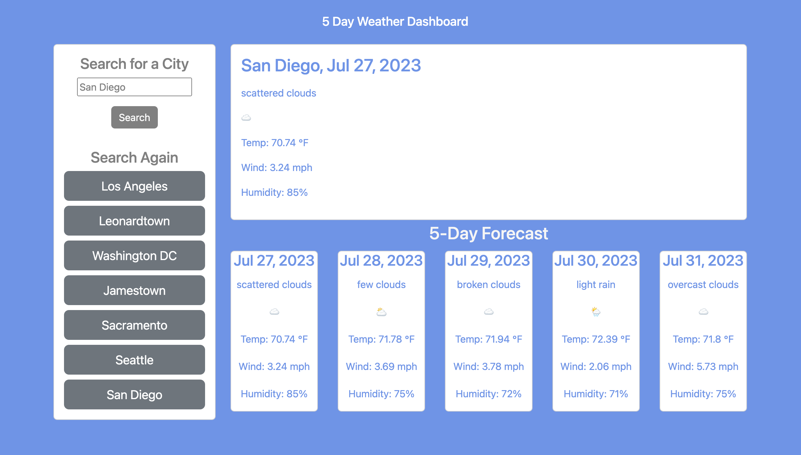

# 5 Day Forecast

## User Story
AS A traveler

I WANT to see the weather outlook for multiple cities

SO THAT I can plan a trip accordingly

## Acceptance Criteria
GIVEN a weather dashboard with form inputs

WHEN I search for a city

THEN I am presented with current and future conditions for that city and that city is 
added to the search history

WHEN I view current weather conditions for that city

THEN I am presented with the city name, the date, an icon representation of weather conditions, the temperature, the humidity, and the the wind speed

WHEN I view future weather conditions for that city

THEN I am presented with a 5-day forecast that displays the date, an icon representation of weather conditions, the temperature, the wind speed, and the humidity

WHEN I click on a city in the search history

THEN I am again presented with current and future conditions for that city

## Usage
To use this application:

Type a city name into the search bar. Click search. After clicking search, you will see the weather forecast for the next five days displayed. 

After each search, a new button will be added to the search history list underneath the search bar. You may click on any of these buttons to search for its given city's weather forecast. The search history will only save the last 8 searched city names.

## Installation
N/A

## Acknowledgements/References
I used Bootstrap and inline CSS for all stylization of this webpage.

Most of the JavaScript was my own creation; however, I did ask ChatGPT for input on cleaning up/simplifying some of my functions. Overall, I would say ChatGPT helped with roughly 15% of my JavaScript code.

## Screenshot

## Working URL
https://leucisticboi.github.io/5DayForecast/
